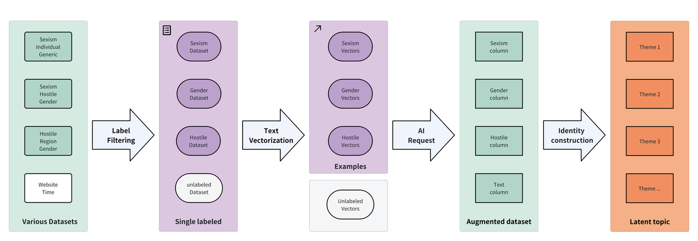

# AugumentedSexism

A repository for augmenting Chinese datasets related to gender discrimination through automated methods. This project provides models and tools to expand existing Chinese gender discrimination datasets, leveraging AI APIs to generate new unlabeled examples while maintaining annotation accuracy.

## Project Structure

- **/data**: Contains original and augmented Chinese gender discrimination datasets.
- **/AugmentedSexism**: Includes the dataset augmentation model that generates new examples based on the original data.

## Key Features

- Automatically expands Chinese gender discrimination datasets using AI-powered generation
- Maintains annotation accuracy by using original dataset examples as reference
- Generates high-quality labeled examples for model training or further analysis

## Pipeline


## Requirements

- Python 3.8+
- Valid API key for a supported AI service (see configuration instructions)
- Original Chinese gender discrimination dataset (placed in the /data directory)

## Usage

### 1. Data preparation
Prepare your original Chinese gender discrimination dataset and place it in the `AugumentedSexism/data` directory
- Train data(example data) must include `text` column and default properties which is defined in `AugumentedSexism/main.py` -> DEFAULT -> rule
- Text data(make annotate data) must include `text` column

### 2. Basic Configuration
- Configure your AI service and API key in the `main.py`
- Configure path of train data and test data in the `main.py`

### 3. Run the code
- Run the augmentation script:
   ```bash 
  python main.py

### 4. Attain Result
- check the result in `AugumentedSexism/data/processed`
